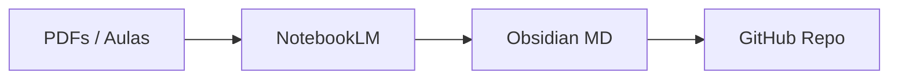

# 📚 Central de Estudos & Anotações

<p align="left">
  
  
  
  
</p>

Repositório centralizado de estudos acadêmicos e cursos de especialização. As anotações são desenvolvidas em **Markdown** utilizando o [Obsidian](https://obsidian.md), sintetizadas e refinadas com auxílio de inteligência artificial via [Google NotebookLM](https://notebooklm.google).

---

## 📌 Sumário

- [Visão Geral](#-visão-geral)
- [Estrutura de Pastas](#-estrutura-de-pastas)
- [Trilha de Aprendizado](#-trilha-de-aprendizado)
- [Workflow de Estudos](#-workflow-de-estudos)

---

## 📂 Estrutura de Pastas

```text
├── 📁 FACULDADE/        # Matérias da grade acadêmica organizadas por período
├── 📁 CURSOS/           # Formações complementares (Alura e outros)
│   ├── 📁 Programacao/
│   └── 📁 Inteligencia-Artificial/
├── 📁 EXEMPLOS/         # Modelos de notas, templates e referências
└── 📁 _assets/          # Diagramas, ilustrações e anexos de apoio
```

---

## 🚀 Trilha de Aprendizado

### 🎓 [FACULDADE](./FACULDADE/)
> Anotações de aula, projetos práticos e sínteses teóricas da graduação.
* **Redes Neurais & IA:** Fundamentos e arquiteturas.
* **Engenharia de Software:** Métodos, ciclo de vida e modelagem.

### 💻 [CURSOS](./CURSOS/)
> Certificações, formações e práticas extracurriculares.
* **Formações Alura:** Aprofundamento em stacks de desenvolvimento.

---

## 🛠️ Workflow de Estudos



1. **Entrada:** Consumo de material bruto (aulas e apostilas).
2. **Síntese:** Extração de tópicos-chave e perguntas guiadas via NotebookLM.
3. **Documentação:** Estruturação local em rede pelo Obsidian.
4. **Backup:** Controle de versão contínuo via GitHub Desktop.

---

<p align="center">
  <sub>Mantido por <a href="https://github.com">Lamarcks</a></sub>
</p>
